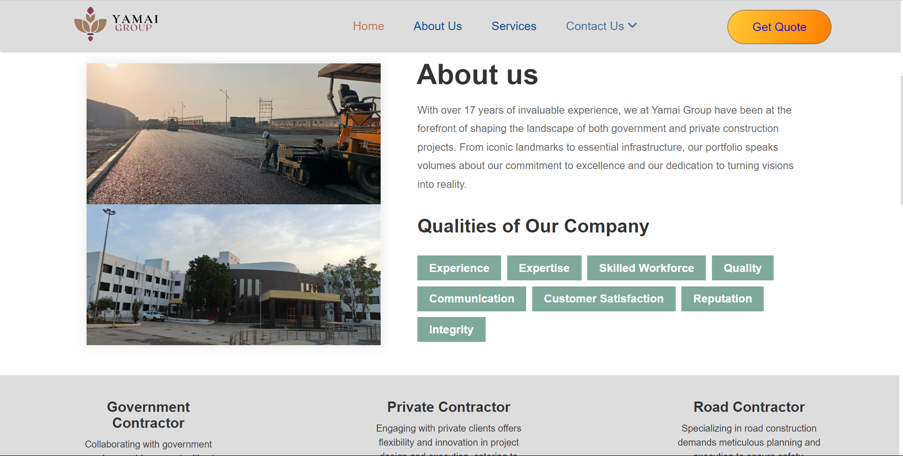

# Yamai Group of Construction Website


This repository contains the source code and resources for the Yamai Group of Construction website project. This comprehensive platform showcases Yamai Group’s ventures and its six affiliated firms, offering
detailed information and facilitating client interaction through various forms.

## Table of Contents
1. [Project Overview](#project-overview)
2. [Features](#features)
3. [Technologies Used](#technologies-used)
4. [Installation](#installation)
5. [Screenshots](#screenshots)

## Project Overview

The Yamai Group of Construction website is designed to provide a modern and professional online presence for the company and its affiliated firms. The website offers detailed information about the company's services and projects, and includes features that facilitate client interaction, such as inquiry, meeting scheduling, and quotation request forms. User submissions are efficiently stored in a database and the company is notified via email, ensuring prompt responses.

## Features

- **Company Overview**: Detailed information about Yamai Group and its six affiliated firms.
- **Services and Projects**: Comprehensive sections detailing the services offered and the projects undertaken by the company.
- **Client Interaction Forms**: Forms for inquiries, meeting scheduling, and quotation requests.
- **User Submission Management**: Efficient storage of user submissions in a database.
- **Email Notifications**: Automatic email notifications to the company for prompt responses.

## Technologies Used

- **HTML**: Structure of the web pages.
- **CSS**: Styling of the web pages.
- **JavaScript**: Client-side scripting.
- **ReactJS**: Frontend framework.
- **NodeJS**: Backend runtime environment.
- **ExpressJS**: Backend framework.
- **MongoDB**: Database management.

## Installation

1. **Clone the Repository**
   ```bash
   git clone https://github.com/AartiSathe23/Yamai-Group.git
   cd Yamai-Group
2. **Install Dependencies**
   ```bash
   npm install
3. **Setup the Database**
   - Ensure MongoDB is installed and running.
   - Create a database for the project and update the database connection details in the backend configuration file.
4. **Start the Development Server**
   ```bash
   npm start

## Screenshots

1. **Home Page**
   
    
  
    
  
    
  
    
    
2. **About Us**  
  
    
  
    

    
  
    
    
3. **Services**  
  
    
  
    

    
  
    

    
  
    
    
4. **Contact Us**  
  
    
  
    

    

     
